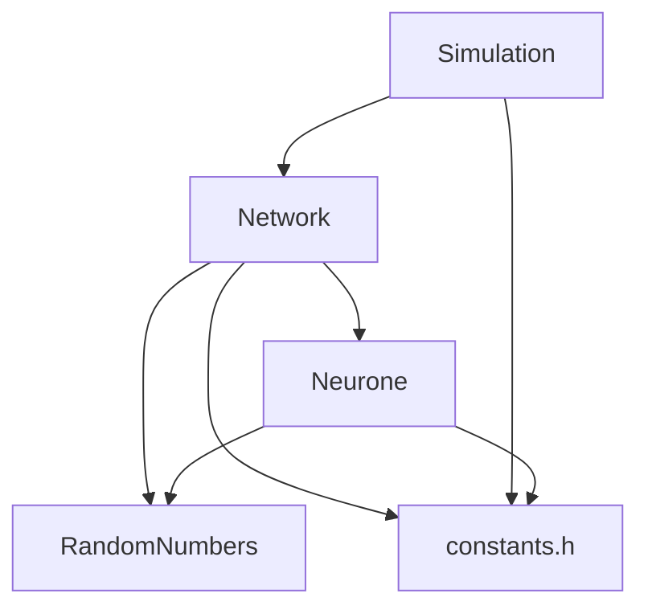

### Table of content

[[_TOC_]]

### Project and classes

Our aim is to modelize a neuronal network to study its behaviour, the interactions between its neurons and its evolution in time. The aim of this program is to simulate a neuronal network based on a simplified model of the cortical neurons made by Eugene Izhikevich (https://www.izhikevich.org/publications/spikes.htm). With this program, we try to understand how the brain works to be able to reconstruct artificialy its behaviour. Here is a description of the classes of the program :

* ___Simulation:___ Simulation is the driving class of the program; it manages the user’s specified parameters and builds the Network of neurons. Then it brings life to the Network during all the simulation duration. At each time-step, the neuronal network will be updated, and prints the results in 3 output files.

* ___Network:___ The Network class represents the environment in which the neurons evolve and interact. Links between its neurons are randomly chosen. The dynamic of the Network is such that it updates every neuron at each time-step to update their firing state. 

* ___Neurone:___ The Neurone class is the smallest unit-class of the program : it gives a simple model of a neuron. There is 5 neurons type. A neuron is represented by a set of parameters, some specifically defined for each type : 4 cellular properties, an excitatory/inhibitory quality, a membrane potential and a relaxation variable. Neurons are updated at each time-step depending on the synaptic current they receive.

* ___Random:___ The Random class is a utility class used to randomly generate values for the different classes of the program. It can return values based on the following distribution: uniform, normal, Poisson and exponential. Its algorithms are based on the C++ random library.

* ___Constants:___ The constants class is a base class for errors thrown in the program and for the general constants used throughout the program. It also contains the data-structures used in some classes.

### What you need to use our program

To compile and use all the fonctionalities offered by the program (documentation, test), you will need the following libraries :
* compilaton : CMake - version 2.6 (https://cmake.org/cmake/help/latest/guide/tutorial/index.html)
* unit testing : Google test library - version 1.8.20 (https://github.com/google/googletest)
* command-line arguments : TCLAP - version 1.2.2 (http://tclap.sourceforge.net/manual.html)
* documentation : doxygen - version 1.10 (https://www.doxygen.nl/index.html)

### Execute it and test it

First of all, you need to clone the project in the folder of your choice :

    git clone https://github.com/ArthurEglin/Izhikevich-trans-neural-network-miniproject_BIO-210.git

Then use the following commands to build the needed folders and set up the program : 

    rm -rf build 

    mkdir build
        
    mkdir doc  

    cd build 

    cmake ..
             
    make      

You can execute the program in different ways. To know which argument you need to provide and which type they are, please use the following command :  

    ./Neurons -h

-    Run the program without parameters input and be guided by the user-friendly interface (this will run a simplified version of the program)
    
    ./Neurons
        
-    Run the program with all parameters input following the TCLAP help with the command (exemple value for each parameter):
    
    ./Neurons -M O -d 0.1 -O test10000 -T 'IB:0.2,LTS:0.4,CH:0.2' -I 10 -C 40 -t 500 -N 10000

You can also specify only the parameters that interest you the other ones will be initialized to their default values.

To run the unit tests, you can use the two commands below. The first one only informs if tests are passed or not. To run the detailed tests and see the result of each unit test, use the second one.

    make test 

    ./testAll

### Code documentation (made with doxygen)

You will need to type in the following command in your terminal :

    make doc

You will then be able to access the documentation either by clicking the .html in the html folder of the previously made doc folder or by executing the following commands (from the build folder) :

    xdg-open ../doc/html/index.html (for Linux Ubuntu)
    open ../doc/html/index.html (for Mac OS)
    “..\doc\html index.html” (for Windows)
    

